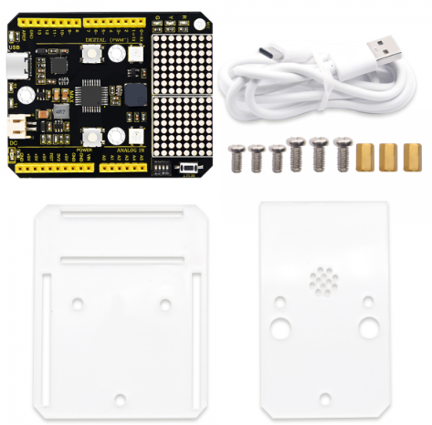
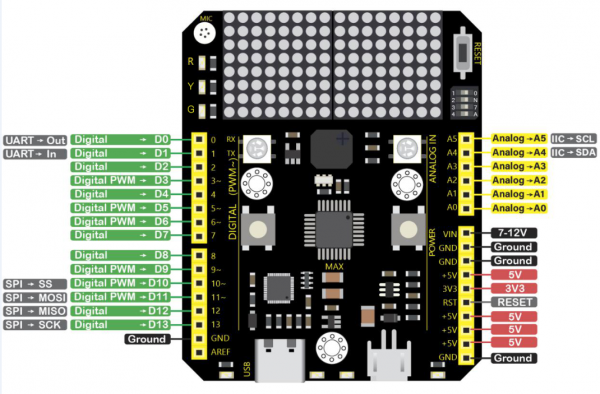
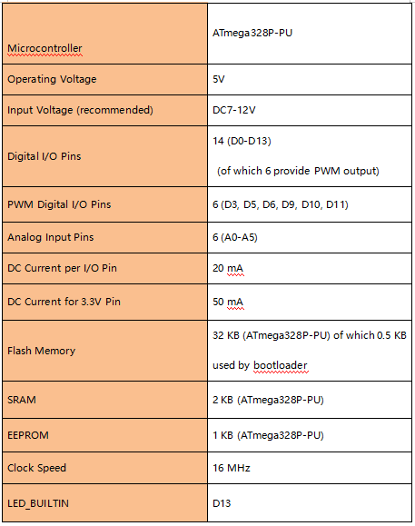
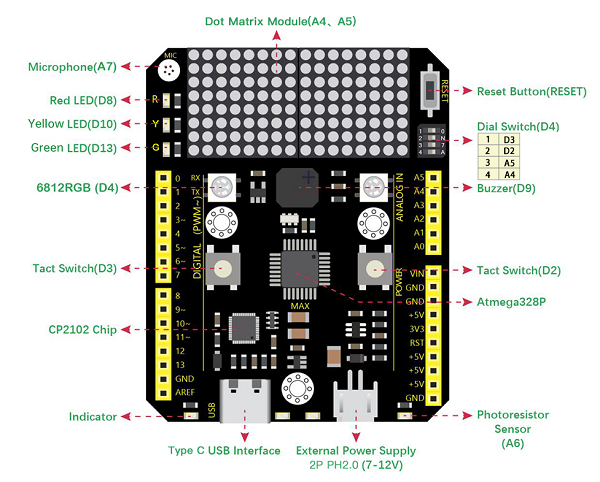

# 1. Product introduction

**KS0501 Keyestudio MAX Kit**

## 1.1 Introduction

Keyestudio UNO MAX kit contains a Max development board, acrylic boards, screws, copper bushes and USB cable(With Type C port).

keyestudio Max development board is an Arduino uno-compatible board, which isbased on ATmega328P MCU, and with a cp2102 Chip as a UART-to-USB converter. MAX development board integrates three LEDs, two 6812RGB LEDs, two button switches, a buzzer, a microphone sensor, a light sensor, and an 8*16 dot matrix.

Using the onboard hardware, you can start 20 project courses. If you are a beginner, a MAX board is enough!

MAX can also be connected to all arduino sensors and modules, and it is also compatible with all arduino shield boards.Now, use MAX to enter the magical world of ARDUINO!

## 1.2 Max development board Pinout

Max has 14 digital input/output pins (of which 6 can be used as PWM outputs), 6 analog inputs, a 16 MHz quartz crystal, a USB connection, a power jack, 2 ICSP headers and a reset button.

It contains everything needed to support the microcontroller; simply connect it to a computer with a USB cable or power it via an external DC power jack (DC 7-12V) or via female headers Vin/ GND(DC 7-12V) to get started.

## 1.3 Max development board onboard interface

- red LED: D8
- yellow LED: D10
- green LED: D13
- 6812 RGB LED: D4
- two button switches: D2, D3
- buzzer: D9
- microphone sensor: A7
- light sensor: A6
- 8*16 dot matrix：A4,A5 (I2C interface)
- 4-digit DIP switch: on right, D2, D3, A4, A5, these onboard components interface is connected. on left, these interface is disconnected,
- They are connected to the corresponding interface on the max board pin header.