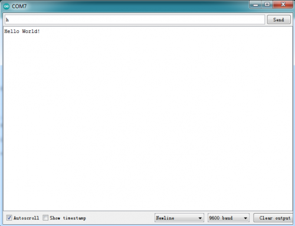

### Project 1 Hello world


**1. Project instruction**

As the beginning of all programming languages, Hello world occupies an unchangeable position, so the first project of our Arduino tutorial starts with hello world.

The "Hello, world" program refers to a computer program that outputs the string "Hello, world" on the computer screen.

In this project, the computer is the Max control board and the screen is the serial monitor. This project only needs one development board and one USB cable.

**2. Project code**

```c
/*
keyestudio Max Development Board
Project 1
hello world
http://www.keyestudio.com
*/

int val;//define variable val

void setup()
{
	Serial.begin(9600);//Set the baud rate to 9600, which must be consistent with the software settings.
}

void loop()
{
    val=Serial.read();//Read the instructions or characters sent by the PC to the Arduino and assign them to val
    if(val=='h')//Judging whether the received command or character is "h".
    {
        //If the received is "h"
        Serial.println("Hello World!");//Display "Hello World!"
    }
}
```

**3. Project results**

Open the Arduino IDE, copy and paste the code in the IDE, click Verify to compile, and check the program for errors. At this time, the code has not been uploaded to the Max board. Click upload, you can see the TX and RX LEDs on the Max board flash a few times, and the IDE prompts Done uploading. Upload the code to the development board, when enter "h" in the Serial Monitor, it will display "Hello, world!".

