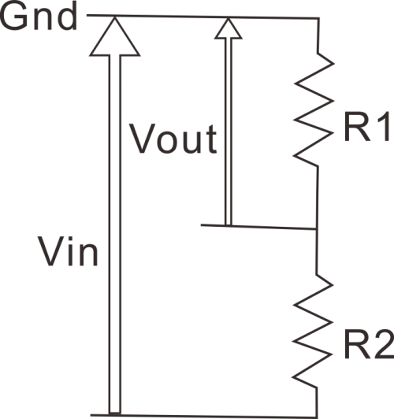
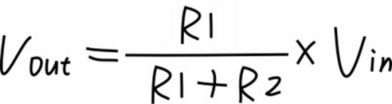
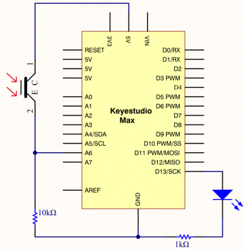

### Project 10 To make a night light


**1.Project instruction**

A photoresistor, relies on light to work. In the dark environment, it has high resistance. The stronger the light intensity is, the smaller its value is,thereby, we could check the light intensity through reading its resistance value.

We will make a photo-sensitive light which will adjust its light intensity with the ambient environment.

**2.Project Principle** 

Photoresistor , a kind of special electronic component, can transfer light signals into electronic signals. It contains special light-conductive material and is sealed with plastic and glass packaging. As the light is irradiated on this kind of photo-conductive material, its the resistance value will get small rapidly.

The photoresistor has a very high resistance in a dark environment. The stronger the light, the lower the resistance value. As the resistance value at both ends decreases, the Vout voltage increases (the value read from the analog port also increases, and the value of the analog port 0~1023 corresponds to the voltage value of 0~5V).

Why does the voltage decrease? Then we need to explain through physics knowledge-the principle of partial pressure. Let us look at a typical voltage divider circuit and see how it works.



Input voltage Vin(5V) connected to two resistors, only measures the voltage of Vout on resistor R1. Its voltage is less than input voltage。 The formula of the voltage of Vout is as follows.



R1 represents 10k resistor, R2 is photoresistor. When R2 is in the dark environment, its value gets larger but Vout’s value is close to 0v. Once there is light, the value of R2 will get smaller and the value of Vout increases instead.

Judged from the above formula, R1 should be in 1k~10k, otherwise, the value of Vout is not apparent.

**3.Project circuit**



**4.Project code**

```c
/*
keyestudio Max Development Board
Project10
To make a night light
http://www.keyestudio.com
*/

int LED = 13; // set LED to pin 13
int val = 0;   //set analog pin 0 to read the voltage value of photosensitive diode

void setup()
{
pinMode(LED,OUTPUT);  // set LED to output
Serial.begin(9600);  // set serial baud rate to 9600
}

void loop()
{
      val = analogRead(A6);  // read the voltage value 0~1023
      Serial.println(val); // check the change of voltage value in serial
      if(val>300)
      {   // once exceed the set value, LED will be off
      digitalWrite(LED,LOW);
      }else
      {  // otherwise, LED is on
      digitalWrite(LED,HIGH);
      }
      delay(10);   //delay in 10ms
} 
```

**5.Project results**

After wiring up hardware, open Arduino IDE to input code and LED will be on.

Turn on flashlight and point at photoresistor, LED is off. Once you move flashlight away, LED will be on again.

**6. Project expansion**

For the test code, we read analog value of photoresistive diode through analog port.

Once the light is irradiated, the analog value read decreases. As the analog value is more than 300, LED will be off, on the contrary, the analog is less than and equivalent to 300, LED on.