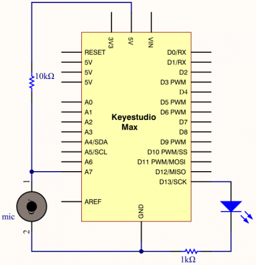
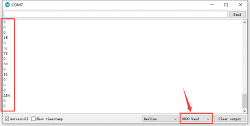

### Project 11 Voice-activated

**1.Project instruction** 

Akin to a microphone, sound sensor can receive sound waves and show the vibration image of sound but not to measure the intensity of noise. It has a built-in condenser electret microphone that is sensitive to sound.

The sound waves vibrate the electret film in the microphone, which causes the change of capacitance, and generates a correspondingly changed tiny voltage. This voltage is then converted into a 0-5V voltage, received by the data collector after A/D conversion, and sent to Arduino UNO.

**2.Project Principle**

- Use 5v DC power supply (working voltage 3.3V-5V)
- With analog output AO, real-time microphone voltage signal output
- High sensitivity, electret condenser microphone (ECM) sensor
- Can detect the sound intensity of ambient environment.

Note: This sensor can only identify the presence or absence of sound (according to the principle of vibration) and cannot identify the size of the sound or the sound of a specific frequency.

**3.Project circuit**



**4.Project code**

```c
/*
keyestudio Max Development Board
Project11
Voice-activated
http://www.keyestudio.com
*/
const int SOUND_PIN = A7;
const int LED_PIN = 13;

void setup() 
{
  pinMode(LED_PIN, OUTPUT);
  Serial.begin(9600);
}

void loop() 
{
  // read A7 analog signal 
  int value = analogRead(SOUND_PIN);
  // output signal value
  Serial.println(value);
  if(value > 5)
  {
    // more than threshold, pin 13 is high level and LED on    digitalWrite(LED_PIN, HIGH);
    delay(100);
  }
  else
  {
    // less than threshold, pin 13  is low level and LED off
    digitalWrite(LED_PIN, LOW);
    delay(100);
  }
}
```

**5.Project results**

Download code, open serial monitor and set baud rate to 9600. The monitor shows the analog value detected by MIC. The louder the sound is, the larger the value is. In addition, as the analog value is more than 5, green LED will be on, otherwise, LED will be off.

