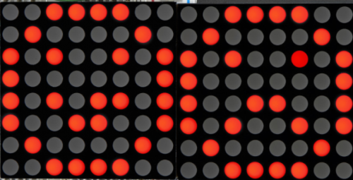
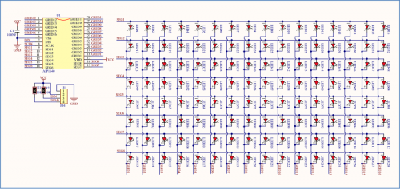
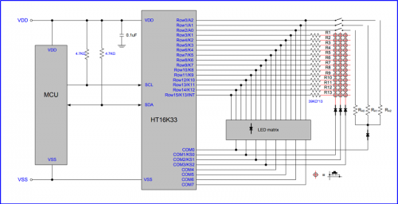
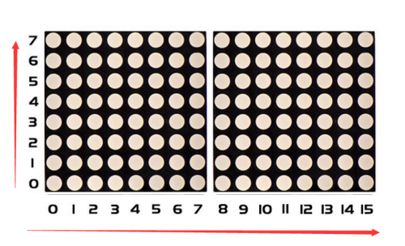
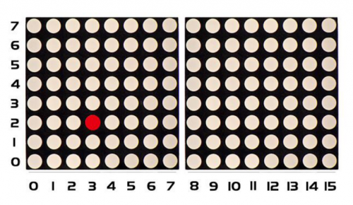

### Project 12 8*16 dot matrix-turn on a led



**1.Project instruction**

The 8 * 16 dot matrix integrated on the MAX board uses I2C communication. As long as 2 signal pins, up to 128 LEDs can be controlled, and interesting displays such as numbers, characters, and graphics can be displayed.

The 8 * 16 dot matrix is also great for making scrolling displays or small video displays. In our example, we set it up so words flow from one matrix to the other. Can be used for advertising display.

The 8 * 16 dot matrix uses a HT16K33 driver chip that does all the heavy lifting for you. This chip has a built in clock so they multiplex the display. Through a simple I2C interface, you can control the chip work and drive 8 * 16 Dot matrix screen.

Now we are about to start many 8*16 dot matrix projects, let’s first turn on a light on the dot matrix.

**2.Project circuit**





**3.Project Principle**

The display principle of 8*16 dot matrix is very simple. The single-chip microcomputer can drive 8*16 dot matrix through HT16K33 chip according to above circuit diagram. The arrangement of the dot matrix is as follows: 8 LED lights in the horizontal direction and 16 LED lights in the vertical direction. The total number of lights is 128. In order to quickly find the position of the light, we number the horizontal lights from 0-7, and the vertical lights from 0-15.



How to turn on a LED on dot matrix?



According to above picture, the coordinate of red point is（2,3）, and we put coordinate value in the following code.


**4.Project code**

```c
/*
keyestudio Max Development Board
Project 12
 8*16 dot matrix-turn on a led
http://www.keyestudio.com
*/	

#include <Wire.h>
#include "Keyestudio_LEDBackpack.h"
#include "Keyestudio_GFX.h"
Keyestudio_8x16matrix matrix = Keyestudio_8x16matrix();
void setup() 
{
 matrix.begin(0x70);  // pass in the address
}
void loop() 
{
  matrix.clear();  // clear display
  matrix.drawPixel(2, 3, LED_ON);  
  matrix.writeDisplay();  // write the changes we just made to the display
}
```

**5.Project results**

After wiring up, opening Arduino IDE and downloading code. The LED (as shown below) turns on.