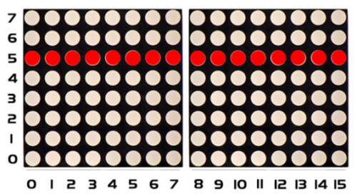
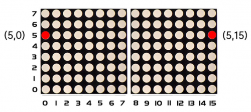

### Project 13 8*16 dot matrix-turn on one line

**1.Project instruction** 

In previous program, we light up a coordinate point. In this project, we will light up a row of LEDs.

**2.Project Principle**



To light a row of LEDs, we need to make use of function matrix.drawLine. Lighting up the start and terminal point on a row of LEDs indicates all LEDs on this row are on, therefore, we need to decide the start and terminal point of this row of LEDs.



Seeing from the above picture, the start point locates (5,0) and the end one is（5,15). Next, we place the value in the below code.

**3.Project circuit**


**4.Project code**

```c
/*
keyestudio Max Development Board
Project 13
 8*16 dot matrix-turn on one line
http://www.keyestudio.com
*/
#include <Wire.h>
#include "Keyestudio_LEDBackpack.h"
#include "Keyestudio_GFX.h"
Keyestudio_8x16matrix matrix = Keyestudio_8x16matrix();

void setup() 
{
 matrix.begin(0x70);  // pass in the address
}

void loop() 
{
 matrix.clear();
 matrix.drawLine(5,0, 5,15, LED_ON);
 matrix.writeDisplay();  // write the changes we just made to the display
}
```

