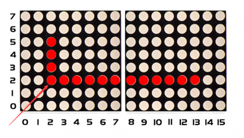
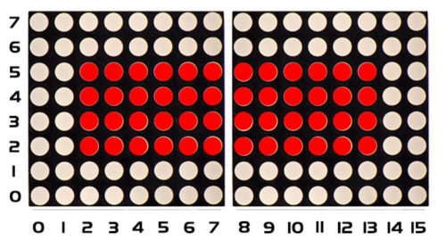

### Project 14 8*16 dot matrix-draw a rectangle

**1.Project instruction** 

I believe that you get more interested in our programs. In this part, we will display a rectangle on 8*16 dot matrix.

**2.Project Principle**


So, how to show a rectangle? We need use a function matrix.fillRect, which implies that you have to make sure a point on dot matrix so as to draw a square or rectangle, as shown below:



For example, we will draw a rectangle 4 in width and length in 12 from the point（2.2). What we need to do is put the value of width and length behind the point（2.2). Therefore, we get the code（2，2，4,12).

If display a square with 4 in width and length, its code are supposed to be (2，2， 4,4）.

**3.Project circuit**


**4.Project code**

```c
/*
keyestudio Max Development Board
Project 14
8*16 dot matrix-turn on a rectangle
http://www.keyestudio.com
*/

#include <Wire.h>
#include "Keyestudio_LEDBackpack.h"
#include "Keyestudio_GFX.h"
Keyestudio_8x16matrix matrix = Keyestudio_8x16matrix();

void setup() 
{
 matrix.begin(0x70);  // pass in the address
}

void loop() 
{
  matrix.clear();
  matrix.fillRect(2,2, 4,12, LED_ON);
  matrix.writeDisplay();  // write the changes we just made to the display
}
```

**5.Project results**

After wiring up, opening Arduino IDE and downloading code. The corresponding LEDs is turned on.

