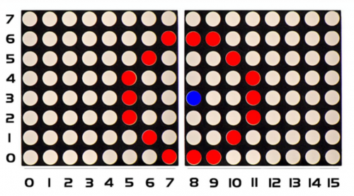
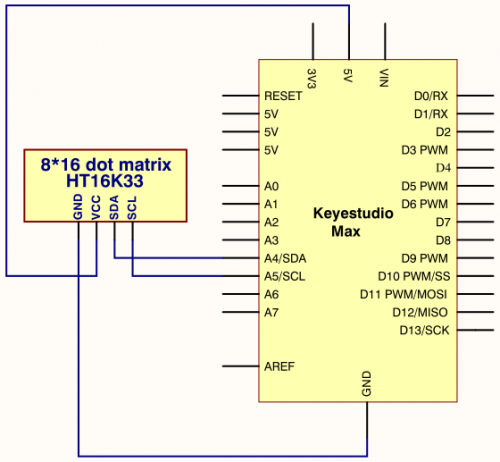
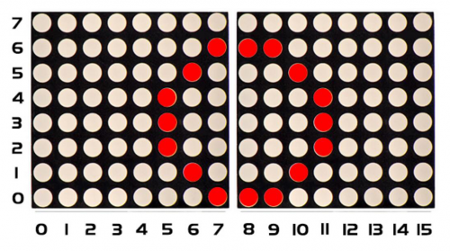

### Project 15 8*16 dot matrix-produce a circle

**1.Project instruction**  

In this program, we will generate a circle on 8*16 dot matrix.

**2.Project Principle**


To show a circle with a radius of 3, we could use a function matrix.drawCircle. Select a central point to decide its coordinate and check radius value, as shown below:



The coordinate of center point of circle is（3,8), its radius is 3. We could put value（3,8, 3, ）in the following code. If we want to draw a circle with a constant center point and a radius of 2, we just need to change the value behind coordinate of center point into 2.

**3.Project circuit**



**4.Project code**

```c
/*
keyestudio Max Development Board
Project 15
 8*16 dot matrix-turn on a circle
http://www.keyestudio.com
*/
#include <Wire.h>
#include "Keyestudio_LEDBackpack.h"
#include "Keyestudio_GFX.h"
Keyestudio_8x16matrix matrix = Keyestudio_8x16matrix();

void setup() 
{
 matrix.begin(0x70);  // pass in the address
}

void loop() 
{
 matrix.clear();
 matrix.drawCircle(3,8, 3, LED_ON);
 matrix.writeDisplay();  // write the changes we just made to the display
 delay(500);
}
```

**5.Project results**

After wiring up, opening Arduino IDE and downloading code. The corresponding LEDs is turned on, as shown below:

