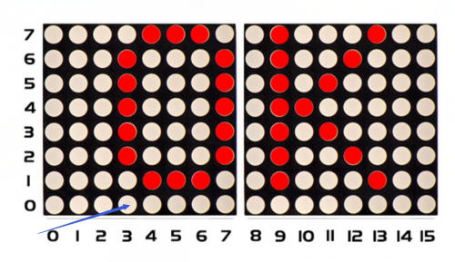
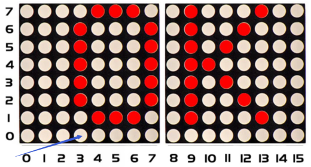

### Project 16 8*16 dot matrix-display texts and numbers

**1.Project instruction**

In this project, we will make 8*16 dot matrix produce some numbers and texts, like advertisement board at bus station.

**2.Project Principle**

This program is pretty easy. We only need to confirm the coordinate of texts and numbers. Let’s conduct an experiment to illustrate.

We set the display area to start from number 3 on horizontal coordinate and number zero on vertical coordinate, as shown below



We add the texts to be shown in the code matrix.print after getting the coordinate of text. Note: numbers can be shown directly, but texts need adding double quotes.


**3.Project code**

```c
/*
keyestudio Max Development Board
Project 16
 8*16 dot matrix-display text and numbers
http://www.keyestudio.com
*/
#include <Wire.h>
#include "Keyestudio_LEDBackpack.h"
#include "Keyestudio_GFX.h"
Keyestudio_8x16matrix matrix = Keyestudio_8x16matrix();

void setup() 
{
 matrix.begin(0x70);  // pass in the address
}

void loop() 
{
 matrix.setTextSize(1);// set size of text
 matrix.setTextWrap(false);  // we dont want text to wrap so it scrolls nicely
 matrix.setTextColor(LED_ON);
 matrix.setRotation(1);// show rotation
 matrix.clear();
 matrix.setCursor(3,0);//set the coordinate of text
 matrix.print("OK");   //show OK
 matrix.writeDisplay();
 delay(1000);
 }
```

**4.Project results**

After wiring up, opening Arduino IDE and downloading code. The control board shows“OK”, as shown below:

