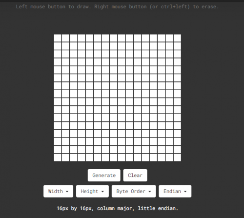
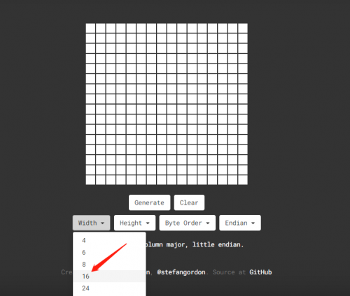
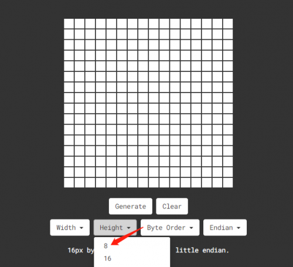
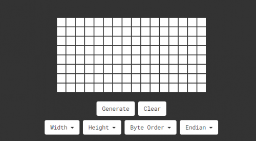
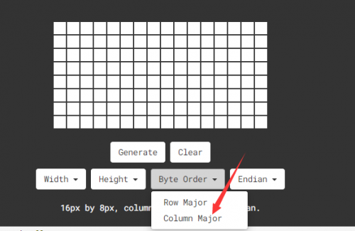
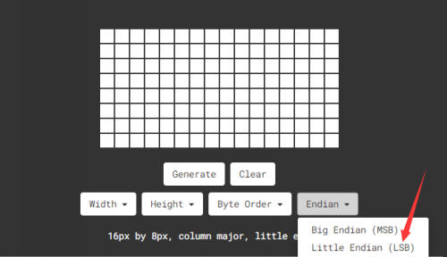
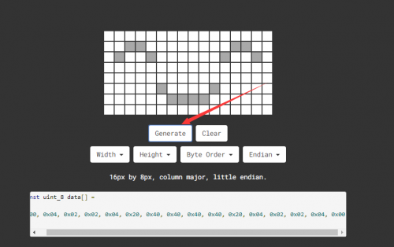
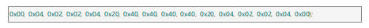
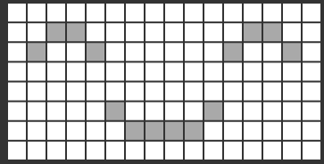

### Project 17 8*16 dot matrix-display images

**1.Project Instruction**

A large number of display devices, like cellphone, computer screen and advertisement board, are made of tiny light-emitting unit. The 8*16 dot matrix aren’t able to show exquisite and high pixel pictures but some cute and customized heart-shape picture, smiley face and so on, even though consisting of 128 pcs light-emitting units.

**2.Project Principle**

- Introduction for Modulus Tool
- The online version of dot matrix modulus tool:
- http://dotmatrixtool.com/#



The dot matrix is 8*16 in this project, thereby, set the height to 8, width to 16, as shown below.







As same as dot matrix on Max board

Click Byte order to select “column major”



Tap endian to set little endian(lsb)



Then we draw the pattern we need.


Click generate to get hexadecimal code.





Move the above hexadecimal code into the code of the below program.

**3.Project circuit**


**4.Project code**

```c
/*
keyestudio Max Development Board
Project 17
8*16 dot matrix-display images
http://www.keyestudio.com
*/
#include <Wire.h>
#include "Keyestudio_LEDBackpack.h"
#include "Keyestudio_GFX.h"
Keyestudio_8x16matrix matrix = Keyestudio_8x16matrix();

void setup() 
{
 matrix.begin(0x70);  // pass in the address
}
static const uint8_t PROGMEM
smile_bmp[] ={0x00, 0x04, 0x02, 0x02, 0x04, 0x20, 0x40, 0x40, 0x40, 0x40, 0x20, 0x04, 0x02, 0x02, 0x04, 0x00};

void loop() 
{
  //matrix.setRotation(1);
  matrix.clear();
  matrix.drawBitmap(0, 0, smile_bmp, 8, 16, LED_ON);
  matrix.writeDisplay();
  delay(1000);
}
```

**5.Project results**

After wiring up, opening Arduino IDE and downloading code. The control board shows the following picture.

