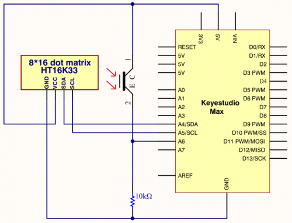
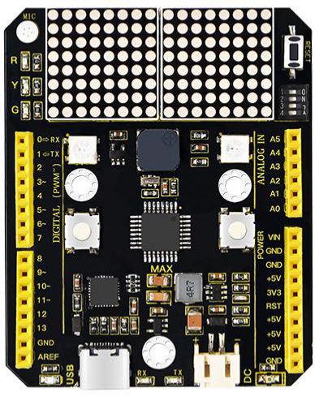

### Project 18 8*16 dot matrix-knob control

**1.Project instruction**

There are on-board button switches on Max board, we will combine button switch and 8*16 dot matrix to make an interactive display.

**2.Project principle**

The signal pins of two buttons are connected to D2 and D3. Press left button, 8*16 dot matrix shows“L”; press right button, 8 *16 dot matrix shows“R”.

**3.Project circuit**



**4.Project code**

```c
/*
keyestudio Max Development Board
Project 18
8*16 dot matrix-knob control
http://www.keyestudio.com
*/
#include <Wire.h>
#include "Keyestudio_LEDBackpack.h"
#include "Keyestudio_GFX.h"
Keyestudio_8x16matrix matrix = Keyestudio_8x16matrix();
int K1=3;
int K2=2;
int x;

void setup() 
{
 matrix.begin(0x70);  // pass in the address 
  pinMode(K1,INPUT);
  pinMode(K2,INPUT);
  matrix.drawCircle(3,8, 3, LED_ON);
  matrix.writeDisplay();  // write the changes we just made to the display
}

void loop() 
{
  int K1_level=digitalRead(K1);
  int K2_level=digitalRead(K2);
  if(K1_level==0)
  {  
      matrix.setTextSize(1);
      matrix.setTextWrap(false);  // we dont want text to wrap so it scrolls nicely
      matrix.setTextColor(LED_ON);
      matrix.setRotation(1);
      matrix.clear();
      matrix.setCursor(2,0);
      matrix.print("L");
      matrix.writeDisplay();
  }
  if(K2_level==0)
  { 
      matrix.setTextSize(1);
      matrix.setTextWrap(false);  // we dont want text to wrap so it scrolls nicely
      matrix.setTextColor(LED_ON);
      matrix.setRotation(1);
      matrix.clear();
      matrix.setCursor(9,0);
      matrix.print("R");
      matrix.writeDisplay(); 
  }
}
```

**5.Project results**

After the wiring-up, open Arduino IDE and download code. The control board shows the following picture.



The dot matrix of control board shows letter O. However, the left dot matrix will show letter“L”when left button is pressed; on the contrary, the right dot matrix will display letter“R”.