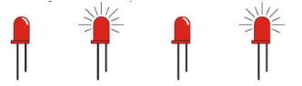
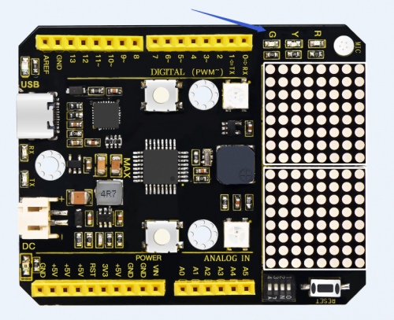

### Project 2 LED blink

**1. Project instruction**



The next step is to start a very classic project-blink.This project is to light up an LED and control the delay time.It is an entry-level project for Arduino beginners.

In this example, the LED we use is an LED onboard MAX,As shown in the picture below, it is directly connected to the D13 pin.



**2. Project Principle**

LED is a type of semiconductor called "Light Emitting Diode "which is an electronic device made of semiconductor materials (silicon, selenium, germanium, etc.). It is dubbed indicator, digital and word display in circuit and device.

**3. Project circuit**


**4. Project code**

```c
/*
keyestudio Max Development Board
Project 2
Blink
http://www.keyestudio.com
*/
// the setup function runs once when you press reset or power the board
void setup() 
{
  // initialize digital pin 13 as an output.
  pinMode(13, OUTPUT);
}

// the loop function runs over and over again forever
void loop() 
{
  digitalWrite(13, HIGH);   // turn the LED on (HIGH is the voltage level)
  delay(1000);              // wait for a second
  digitalWrite(13, LOW);    // turn the LED off by making the voltage LOW
  delay(1000);              // wait for a second
}
```

When the upload is successful, it will prompt "Done uploading". After everything is successful, you can see the LED of D13 is on for one second and off for one second.

**5. Code description**

- setup()：function is the basic function of the Arduino program and must be included. It will only be executed once when the program is running. It is commonly used to define pins and declare variables.
- loop(): loop function is also a necessary function of the Arduino program. Its function is to run after setup() is executed once, and it keeps repeating.
- digitalWrite(13, HIGH)： Set the output voltage of the pin to high or low. Here D13 is high level, so that the LED can light up.
- delay(1000)：The delay function is a delay function, the value here is 1000, the unit is milliseconds (ms), 1000ms is 1 second. What if you want to make the LED flash faster? Yes, you only need to modify the delay. Decrease the value, it means that the waiting time is shorter, that is, the flashing is faster. or, the flash is slower.