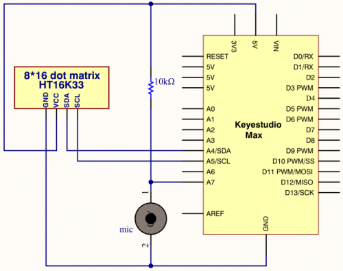

### Project 20 8*16 dot matrix-sound control

**1.Project instruction**

In this lesson, we will create more fantastic programs with microphone sensor and 8*16 dot matrix

**2.Project Principle**

The signal pin of microphone sensor is connected to A7 of Max development. The circle on dot matrix will enlarge with the sound intensity. The stronger the sound intensity, the larger the circle gets.

**3.Project circuit**



**4.Project code**

```c
/*
keyestudio Max Development Board
Project 20
8*16 dot matrix-sound control
http://www.keyestudio.com
*/
#include <Wire.h>
#include "Keyestudio_LEDBackpack.h"
#include "Keyestudio_GFX.h"
int mic = A7;
Keyestudio_8x16matrix matrix = Keyestudio_8x16matrix();
int Mic_val;

void setup() 
{
Serial.begin(9600);
Serial.println("16x8 LED Matrix Test");
pinMode(mic,INPUT);
matrix.begin(0x70);  // pass in the address
}

void loop() 
{
  Mic_val=analogRead(mic);
  Mic_val=map(Mic_val,0,1023,0,10);
  matrix.clear();
  matrix.drawCircle(3,8,Mic_val, LED_ON);
  matrix.writeDisplay();  // write the changes we just made to the display
  delay(10);
}
```

**5.Project results**

Open Arduino IDE and download code. The MIC component of control board tests the sound and the louder the sound is, the bigger the shown aperture is.