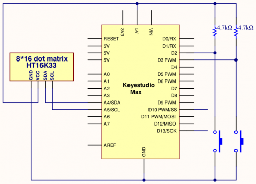

### Project 21 8*16 dot matrix-game project

**1.Project instruction**

We could play games through Max development board. Can you imagine that?

Let’s get started.

**2.Project Principle**

Game 1: gluttonous snake

Press two buttons on max board, the gluttonous snake moves clockwise and anticlockwise.

Game 2: Breakout clone

Press buttons simultaneously to start.

**3.Project circuit**



**4.Project code1**

```c
/*
keyestudio Max Development Board
Project 21
8*16 dot matrix-gluttonous snake 
http://www.keyestudio.com
*/
#include <Wire.h>
#include <Keyestudio_GFX.h>
#include <Keyestudio_LEDBackpack.h>
// Button pin
const int buttonRightPin = 2;
const int buttonLeftPin  = 3;
int* buttonPin;
 int* buttonState;
// Game constants
// buttons
const int RIGHTBUTTON = 0;
const int LEFTBUTTON  = 1;
// direction
const int TOP    = 0;
const int RIGHT  = 1;
const int BOTTOM = 2;
const int LEFT   = 3;
// Snake
const int MAX_SNAKE_LENGTH = 100;
// Variables
//Keyestudio_8x8matrix matrix = Keyestudio_8x8matrix();  // Display
Keyestudio_8x16matrix matrix = Keyestudio_8x16matrix();
int direction = TOP;      // direction of movement
int snakeX[MAX_SNAKE_LENGTH];     // X-coordinates of snake
int snakeY[MAX_SNAKE_LENGTH];    // Y-coordinates of snake
int snakeLength = 1;        // nr of parts of snake
boolean buttonRead = false;            // is button already read in this loop
unsigned long prevTime = 0;          // for gamedelay (ms)
unsigned long delayTime = 500;        // Game step in ms
int fruitX, fruitY;
unsigned long fruitPrevTime = 0;
unsigned long fruitBlinkTime = 1000/250;
int fruitLed = LED_ON;
void setup(){
  Serial.begin(9600);
  Serial.println("Snake is started");
  randomSeed(analogRead(0));
  // Init led matrix
  matrix.begin(0x70);
  // init buttons
  int buttonpins[] = {buttonRightPin, buttonLeftPin};
  initButtons(buttonpins, 2);
  // init snake
  snakeX[0] = 4;
  snakeY[0] = 7;
  for(int i=1; i<MAX_SNAKE_LENGTH; i++){
    snakeX[i] = snakeY[i] = -1;
  }
  makeFruit();
}
void loop(){
  checkButtons();
  unsigned long currentTime = millis();
  if(currentTime - prevTime >= delayTime){
    nextstep(); 
    buttonRead = false;
    prevTime = currentTime;
  }
  draw();
}
void initButtons(int pinNumbers[], int length){
  Serial.println("initButtons");
  // Copy PIN numbers
  buttonPin = new int[length];
  for(int i=0; i<length; i++){
    buttonPin[i] = pinNumbers[i];
  }
  // Initialize button state
  buttonState = new int[length];
  for(int i=0; i<length; i++){
    buttonState[i] = LOW;
  }
  
  for(int i=0; i<length; i++)
  {
    Serial.print(buttonPin[i]);
    Serial.print(buttonState[i]);
  } 
}
boolean buttonClicked(int index){
  // current state
  int state = digitalRead(buttonPin[index]);
  boolean buttonClick = false;
  // button has pressed
  if(buttonState[index] == HIGH){
    if(state == LOW){
      buttonClick = true;
    }
  }
  buttonState[index] = state;
  return buttonClick;
}
void checkButtons(){
  if(!buttonRead){
    int currentDirection = direction;
    if(buttonClicked(LEFTBUTTON)){
      direction--;
      if(direction < 0){
        direction = LEFT;
      }
    }
    else if(buttonClicked(RIGHTBUTTON)){
      direction++;
      if(direction > 3){
        direction = TOP;
      }
    }
    buttonRead = (currentDirection != direction);
  }
}

void draw()
{
  matrix.clear();
  drawSnake();
  drawFruit();
  matrix.writeDisplay();
}

void drawSnake()
{
  for(int i=0; i<snakeLength; i++){
    matrix.drawPixel(snakeX[i], snakeY[i], LED_ON);
  }
}

void drawFruit()
{
  if(inPlayField(fruitX, fruitY))
  {
    unsigned long currenttime = millis();
    if(currenttime - fruitPrevTime >= fruitBlinkTime){
      fruitLed = (fruitLed == LED_ON) ? LED_OFF : LED_ON;
      fruitPrevTime = currenttime;
    }
    matrix.drawPixel(fruitX, fruitY, fruitLed);
  }
}
boolean inPlayField(int x, int y){
  return (x>=0) && (x<8) && (y>=0) && (y<16);
}

void nextstep()
{
  for(int i=snakeLength-1; i>0; i--){
    snakeX[i] = snakeX[i-1];
    snakeY[i] = snakeY[i-1];
  }
  switch(direction){
    case TOP:
      snakeY[0] = snakeY[0]-1;
      break;
    case RIGHT:
      snakeX[0] = snakeX[0]+1;
      break;
    case BOTTOM:
      snakeY[0] = snakeY[0]+1;
      break;
    case LEFT:
      snakeX[0]=snakeX[0]-1;
      break;
  }
  if((snakeX[0] == fruitX) && (snakeY[0] == fruitY)){
    snakeLength++;
    if(snakeLength < MAX_SNAKE_LENGTH){      
      makeFruit();
    } 
    else {
      fruitX = fruitY = -1;
    }
  }
}
void makeFruit()
{
  int x, y;
  x = random(0, 7);
  y = random(0, 15);
  while(isPartOfSnake(x, y)){
    x = random(0, 7);
    y = random(0, 15);
  }
  fruitX = x;
  fruitY = y;
}

boolean isPartOfSnake(int x, int y)
{
  for(int i=0; i<snakeLength-1; i++)
  {
    if((x == snakeX[i]) && (y == snakeY[i]))
    {
      return true;
    }
  }
  return false;
}
```

5.Project code2

```c
/*
keyestudio Max Development Board
Project 21
8*16 dot matrix-Breakout clone
http://www.keyestudio.com
*/
#include <Wire.h>
#include "Keyestudio_LEDBackpack.h"
#include "Keyestudio_GFX.h"
#include "Breakout.h"
Keyestudio_8x16matrix matrix = Keyestudio_8x16matrix();
Breakout breakout;
int count = 0;
void setup() {
  Serial.begin(9600);
  Serial.println("8x16 LED Matrix Test");
  pinMode(L_PIN, INPUT);
  pinMode(R_PIN, INPUT);
  matrix.begin(0x70);  // pass in the address
  matrix.setBrightness(0);
}
void loop() {
  // action depends on game state - idealy the state should be a part of the Breakout class or a seperate logic class
  switch(state){
    // setup game
    case SETUP:
      breakout.restart();
      breakout.speed = START_SPEED;
      state = START;
      break;
      case START:
    // ready to start the game, changed to PLAY if the action button is pushed. 
    // Change here if paddle should be able to move before you shoot the first ball and start the game.
      checkActions();
      if(actions == SEL){
      state = PLAY;
      }
      break;
      case LOST:
    // game lost
      breakout.lost();
      reDraw();
      blink(10, 100);
      breakout.restart();
      breakout.speed = START_SPEED;
      state = START;
      break;

    case WON:
    // game won
      breakout.won(); 
      reDraw();
      blink(10, 100);
      breakout.restart();
      state = START;
      break;
      case PLAY:
      // game in play
      {
        if(count > breakout.speed){
          checkControls();
          breakout.play(controls);
          count = 0;
          if(breakout.bricks == 128){
          state = WON;
          }
          if(breakout.ball.y == 7)
            state = LOST;
          }
        delay(20);
        count++;
      }
  }
  reDraw();
}

void reDraw(){
  for(int i = 0; i < 8; i++){   
    for(int j = 0; j < 16; j++){   //change 8 into 16
      if(breakout.level[i][16-j-1] != 'E'){
        matrix.drawPixel(i,j,1);
      }
      else
        matrix.drawPixel(i,j,0);
    }  
  }
  matrix.writeDisplay();
}

void checkActions(){
  int count = 0;
  while(count < 5 && (!digitalRead(R_PIN))&&(!digitalRead(L_PIN))){
    count++;
  }
  if(count > 4){
    actions = SEL;
    return;
  }
  actions = NO;
}
void checkControls(){
  int count = 0;
  while(count < 5 && (!digitalRead(L_PIN))){
    count++;
  }
  if(count > 4){
    controls = LEFT;
    return;
  }
  count = 0;
  while(count < 5 && (!digitalRead(R_PIN))){
    count++;
  }
  if(count > 4){
    controls = RIGHT;
    return;
  }
  controls = NONE;
}
void blink(int times, int wait){
  for(int i = 0; i < times; i++){
    matrix.setBrightness(2);
    matrix.writeDisplay();
    delay(wait);
    matrix.setBrightness(0);
    matrix.writeDisplay();
    delay(wait);
  }
}
```

**5.Project results**

Open Arduino IED and download code 1. Next, you can play “Gluttonous Snake” game. The motion of snake can be controlled by D2 and D3 buttons of control board, in addition, the left button controls the anticlockwise movement and right button is for clockwise motion. Meanwhile, you can press reset button to restart game.

Download code 2, we can start “Breakout clone”. D2 and D3 can control left and right motion for control board. And press these two buttons simultaneously to start game. In the game, you have to make the falling light bounce to clear out bricks via the moving board , otherwise, you will fail.