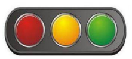
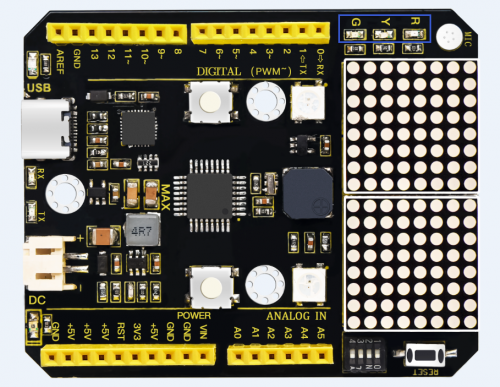

### Project 5 Traffic light

**1.Project instruction**



In the previous program, we have done the LED blinking experiment with one LED. Now, it’s time to up the stakes to do a bit more complicated experiment-traffic light. Actually, these two experiments are similar. While in this traffic light experiment, we use three LEDs with different colors rather than an LED.



**2.Project Principle**

Max board imitates traffic light by controlling flashing time of LED through program.

**3.Project circuit**


**4.Project code**

```c
/*
keyestudio Max Development Board
Project 5
Traffic light
http://www.keyestudio.com
*/

int redled =8; // initialize digital pin 8.
int greenled =10; // initialize digital pin 10.
int yellowled =13; // initialize digital pin 13.

void setup()
{
    pinMode(redled, OUTPUT);// set the pin with red LED as“output”
    pinMode(yellowled, OUTPUT); // set the pin with yellow LED as“output”
    pinMode(greenled, OUTPUT); // set the pin with green LED as“output”
}

void loop()
{
    digitalWrite(greenled, HIGH);//// turn on green LED
    delay(5000);// wait 5 seconds
    digitalWrite(greenled, LOW); // turn off green LED
    for(int i=0;i<3;i++)// blinks for 3 times
    {
        delay(500);// wait 0.5 second
        digitalWrite(yellowled, HIGH);// turn on yellow LED
        delay(500);// wait 0.5 second
        digitalWrite(yellowled, LOW);// turn off yellow LED
    } 
    delay(500);// wait 0.5 second
    digitalWrite(redled, HIGH);// turn on red LED
    delay(5000);// wait 5 second
    digitalWrite(redled, LOW);// turn off red LED
}
```

**5.Project results**

After downloading code, R, Y and G on control board correspond traffic lights. Green LED is turned on for 5s, then yellow LED flashes three times and red LED is turned on 5s and off.