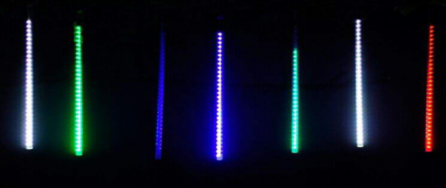
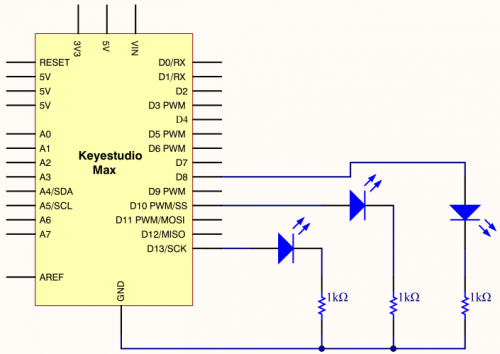

### Project 6 LED Chasing Effect



**1.Project instruction**

Flow light is commonly viewed in our daily life, such as on building, advertisement board and so on. We will show you how to make a flow light in this part.

**2.Project circuit**



**3.Project code**

```c
/*
keyestudio Max Development Board
Project 6
LED Chasing Effect
http://www.keyestudio.com
*/

int  redled = 8;
int  greenled = 10;
int  yellowled =13;

void  setup()
{
 pinMode(redled, OUTPUT);
 pinMode(greenled, OUTPUT);
 pinMode(yellowled, OUTPUT);
}

void loop()
{
    digitalWrite(redled, HIGH);//turn on red light
    delay(100);//delay in 0.1s
    digitalWrite(redled, LOW); //turn off red light
    delay(100);//delay in 1s
    digitalWrite(greenled, HIGH);//turn on green light
    delay(100);//delay in 0.1s
    digitalWrite(greenled, LOW);//turn off green light
    delay(100);//delay in 0.1s
    digitalWrite(yellowled, HIGH);//turn on yellow light
    delay(100);//delay in 0.1s
    digitalWrite(yellowled, LOW);//turn off yellow light
    delay(100);//delay in 0.1s
}
```

**4.Project results**

After downloading code, we will view red, yellow and green LEDs flash ceaselessly.