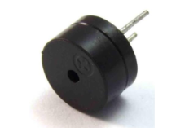
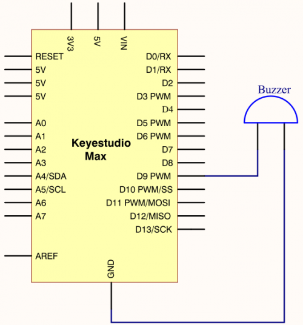

### Project 7 Play Music



**1.Project instruction** 

We can use Arduino to make many interactive works. The most commonly used one is acoustic-optic display. All the previous experiment has something to do with LED. However, the circuit in this experiment can produce sound. Normally, the experiment is done with a buzzer but not a speaker while buzzer is more simpler and easier to use.

The buzzer we introduced here is a passive buzzer. It cannot be actuated by itself, but by external pulse frequencies. 

Different frequency produces different sound. We can use Arduino to code the melody of a song, which is quite fun and simple.

**2.Project Principle**
Passive buzzer is an integrated electronic buzzer without vibration source inside. It must be driven by 2K-5K square wave instead of direct current signals. There is little difference between the two buzzers, but when the pins of the two buzzers are placed up, the passive buzzer comes with green circuit board, and the one sealed with vinyl is an active buzzer.

**3.Project circuit**



**4.Code**

```c
/*
keyestudio Max Development Board
Project 7
Play Music
http://www.keyestudio.com
*/

int  tonepin=9;// set pin9 connecting buzzer
    void setup()
    {
      pinMode(tonepin,OUTPUT);//set IO port to output
    }
    void loop()
    {
      unsigned char i,j;
      while(1)
      {
        for(i=0;i<80;i++)//output a sound with frequency
        {
          digitalWrite(tonepin,HIGH);//emit a sound
          delay(1);//delay in 1ms
          digitalWrite(tonepin,LOW);//don’t emit a sound
          delay(1);//delay 1 ms
        }
        for(i=0;i<100;i++)// output another sound with frequency, 100 controls frequency and can be adjusted also by yourselves
        {
          digitalWrite(tonepin,HIGH);
          delay(2);
          digitalWrite(tonepin,LOW);
          delay(2);
        }
      }
}
```

From the above code, delay in the“for”statement controls the frequency, like the control of a square wave. Setting the delay time to 1ms for high and level implies that the cycle of square wave is 2ms and the frequency of sound is 500HZ; meanwhile, setting the delay time is 2ms, indicates that the cycle of square wave is 4ms and the sound frequency is 250HZ.

The number 80 and 100 control the time in the“for”statement. 80 in the“for” statement stands for the number of cycle, that is, playing 80 pcs cycle takes 2ms, 160ms in total; equally, when setting the cycle of square wave to 4s, 100 indicates that playing 100 pcs cycle takes 4ms, 400me in total.

**5.Project results**

After uploading code, passive buzzer of control board emits 160ms 500Hz sound then 400ms 250Hz sound.