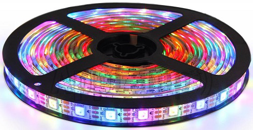
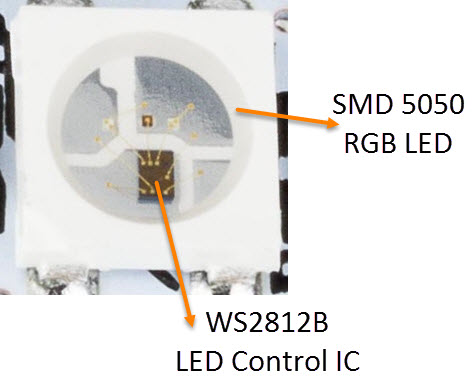
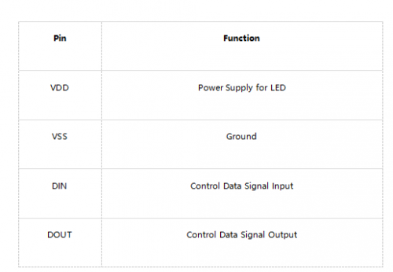
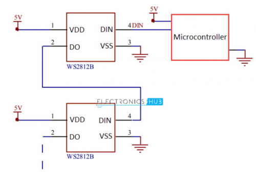
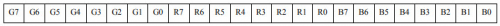
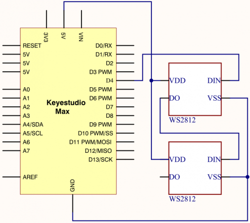

### Project 8 WS2812 RGB LED

**1.Project instruction** 

In this project, we will take a look at an interesting product called the WS2812B Addressable LEDs. They are individually addressable RGB LEDs and are also called by different names like NeoPixel by Adafruit, for example. In this tutorial, we will learn about the WS2812B LEDs, its internal structure and construction and also how to control individually addressable LEDs using Arduino.

**2.Project Principle**
The WS2812B Addressable LED Strip is an intelligent light source that contains a control IC and an RGB LED in a same package, usually in SMD 5050 form factor. The following image shows a strip of WS2812B LEDs.



At first glance, it looks like a regular LED strip. But upon a closer inspection, you can find the WS2812B LED Control IC integrated into the SMD 5050 RGB LED Package. The following blown up image shows the same.



Individual WS2812B LED Block has four pins namely VDD, VSS (GND), DIN and DOUT. The functions of these pins are very simple and the following table gives a simple function description of the pins.

The power supply for the WS2812B IC is also supplied through the VDD Pin.



**3.WS2812B LED Application Circuit**

To understand how the WS2812B LEDs can be individually controlled, the following application circuit will be useful. All the WS2812B LEDs are connected in a cascade manner where the DO of the first LED is connected to the DIN of the second LED and so on.

But the first LED has to receive data through its DIN pin from a Microcontroller like Arduino. The following image shows the typical application circuit block diagram.



The data transfer protocol used by the WS2812B LEDs is NRZ Mode. The first DIN Port of the WS2812B LED array receives data from the microcontroller. The data for individual pixel is of 24-bit that consists of individual Red, Green and Blue LED control data of 8-bits each. The order of data must be GRB and the composition of the 24-bit data is shown below. Note that HIGH bit data is sent first.



Once the first WS2812B Block receives the first 24-bit data, the data is sent to its internal latch for further decoding. The remaining data is reshaped by its signal reshaping and amplification circuit and is passed to the next pixel in the cascade through the DO pin.

**4.Project circuit**



**5.Project code**

```c
/*
keyestudio Max Development Board
Project 8
WS2812 RGB LED
http://www.keyestudio.com
*/
#include <Adafruit_NeoPixel.h>
#ifdef __AVR__
#include <avr/power.h>
#endif

#define PIN 4

// Parameter 1 = number of pixels in strip
// Parameter 2 = Arduino pin number (most are valid)
// Parameter 3 = pixel type flags, add together as needed:
//   NEO_KHZ800  800 KHz bitstream (most NeoPixel products w/WS2812 LEDs)
//   NEO_KHZ400  400 KHz (classic 'v1' (not v2) FLORA pixels, WS2811 drivers)
//   NEO_GRB     Pixels are wired for GRB bitstream (most NeoPixel products)
//   NEO_RGB     Pixels are wired for RGB bitstream (v1 FLORA pixels, not v2)
Adafruit_NeoPixel strip = Adafruit_NeoPixel(2, PIN, NEO_GRB + NEO_KHZ800);

// IMPORTANT: To reduce NeoPixel burnout risk, add 1000 uF capacitor across
// pixel power leads, add 300 - 500 Ohm resistor on first pixel's data input
// and minimize distance between Arduino and first pixel.  Avoid connecting
// on a live circuit...if you must, connect GND first.

void setup() {
  // This is for Trinket 5V 16MHz, you can remove these three lines if you are not using a Trinket
  #if defined (__AVR_ATtiny85__)
    if (F_CPU == 16000000) clock_prescale_set(clock_div_1);
  #endif
  // End of trinket special code


  strip.begin();
  strip.show(); // Initialize all pixels to 'off'
}

void loop() {
  // Some example procedures showing how to display to the pixels:
  colorWipe(strip.Color(255, 0, 0), 50); // Red
  colorWipe(strip.Color(0, 255, 0), 50); // Green
  colorWipe(strip.Color(0, 0, 255), 50); // Blue
  // Send a theater pixel chase in...
  theaterChase(strip.Color(127, 127, 127), 50); // White
  theaterChase(strip.Color(127, 0, 0), 50); // Red
  theaterChase(strip.Color(0, 0, 127), 50); // Blue

  rainbow(20);
  rainbowCycle(20);
  theaterChaseRainbow(50);
}

// Fill the dots one after the other with a color
void colorWipe(uint32_t c, uint8_t wait) {
  for(uint16_t i=0; i<strip.numPixels(); i++) {
    strip.setPixelColor(i, c);
    strip.show();
    delay(wait);
  }
}

void rainbow(uint8_t wait) {
  uint16_t i, j;

  for(j=0; j<256; j++) {
    for(i=0; i<strip.numPixels(); i++) {
      strip.setPixelColor(i, Wheel((i+j) & 255));
    }
    strip.show();
    delay(wait);
  }
}

// Slightly different, this makes the rainbow equally distributed throughout
void rainbowCycle(uint8_t wait) {
  uint16_t i, j;

  for(j=0; j<256*5; j++) { // 5 cycles of all colors on wheel
    for(i=0; i< strip.numPixels(); i++) {
      strip.setPixelColor(i, Wheel(((i * 256 / strip.numPixels()) + j) & 255));
    }
    strip.show();
    delay(wait);
  }
}

//Theatre-style crawling lights.
void theaterChase(uint32_t c, uint8_t wait) {
  for (int j=0; j<10; j++) {  //do 10 cycles of chasing
    for (int q=0; q < 3; q++) {
      for (int i=0; i < strip.numPixels(); i=i+3) {
        strip.setPixelColor(i+q, c);    //turn every third pixel on
      }
      strip.show();

      delay(wait);

      for (int i=0; i < strip.numPixels(); i=i+3) {
        strip.setPixelColor(i+q, 0);        //turn every third pixel off
      }
    }
  }
}

//Theatre-style crawling lights with rainbow effect
void theaterChaseRainbow(uint8_t wait) {
  for (int j=0; j < 256; j++) {     // cycle all 256 colors in the wheel
    for (int q=0; q < 3; q++) {
      for (int i=0; i < strip.numPixels(); i=i+3) {
        strip.setPixelColor(i+q, Wheel( (i+j) % 255));    //turn every third pixel on
      }
      strip.show();

      delay(wait);

      for (int i=0; i < strip.numPixels(); i=i+3) {
        strip.setPixelColor(i+q, 0);        //turn every third pixel off
      }
    }
  }
}

// Input a value 0 to 255 to get a color value.
// The colours are a transition r - g - b - back to r.
uint32_t Wheel(byte WheelPos) {
  WheelPos = 255 - WheelPos;
  if(WheelPos < 85) {
    return strip.Color(255 - WheelPos * 3, 0, WheelPos * 3);
  }
  if(WheelPos < 170) {
    WheelPos -= 85;
    return strip.Color(0, WheelPos * 3, 255 - WheelPos * 3);
  }
  WheelPos -= 170;
  return strip.Color(WheelPos * 3, 255 - WheelPos * 3, 0);
}
```

**6.Project results**

After downloading code, two WS2812 RGB LEDs start blinking different colors, then stop flashing, and change different colors.