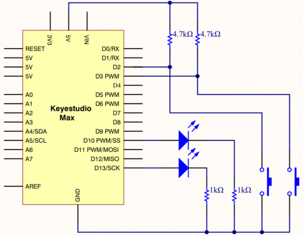

### Project 9 To make a lamp

**1.Project instruction**

In previous lessons, we have known the output function of Arduino. In this experiment, we will make you have better understanding of I/O function through an LED experiment.

**2.Project principle**

The push button switch is usually used to turn on and off the control circuit, and it is a kind of control switch appliance that is widely used.

The push button switch can complete basic controls such as start, stop, forward and reverse rotation, speed change and interlock. Usually each push button switch has two pairs of contacts. Each pair of contacts consists of a NO contact and a NC contact. When the button is pressed, the two pairs of contacts act simultaneously, the NC contact is disconnected, and the NO contact is closed.

**3.Project circuit**



**4.Project code**

```c
/*
keyestudio Max Development Board
Project 9
To make a lamp
http://www.keyestudio.com
*/

int ledpin1=13;//define digital 13
int ledpin2=10;////define digital 10
int buttonpin1=2;//define digital 2
int buttonpin2=3;//define digital 3
int val1;//define variable val1
int val2;//define variable val2

void setup()
{
    pinMode(ledpin1,OUTPUT);//define LED pin1 to output
    pinMode(ledpin2,OUTPUT);//define LED pin2 to output
    pinMode(buttonpin1,INPUT);//define button pin1 to input
    pinMode(buttonpin2,INPUT);//define button pin2 to input 
}

void loop()
{
    val1=digitalRead(buttonpin1);//read the level of digital 2 and set to val
    val2=digitalRead(buttonpin2);//read the level of digital 3 and set to val
    if(val1==HIGH)//detect if the button is pressed, LED on when pressed
    { 
      digitalWrite(ledpin1,LOW);
    }
    else
    { 
      digitalWrite(ledpin1,HIGH);
    }

    if(val2==HIGH)//detect if the button is pressed, LED on when pressed
    { 
      digitalWrite(ledpin2,LOW);
    }
    else
    {
      digitalWrite(ledpin2,HIGH);}
    }
}
```

**5.Project results**

This principle is applied widely in all kinds of circuit and household appliances, such as push switch, indicator and backlight of cellphone.